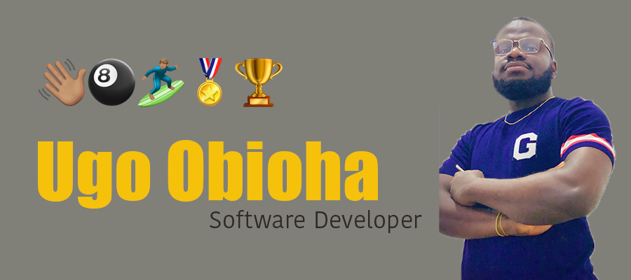

### Hi  I'm Ugocode   :octocat:

I am a software developer / data scientist who is passionate about creating technology to improve lives and economies. 

I am from Nigeria 🇳🇬 

I have a passion for learning and sharing my knowledge, I have built and designed websites for companies, government organisations and individuals. I have done lots of work in Data Science finding solutions to business problems which you can find some here in my repositories. I am currently working with Flutter to create crossplatform apps that solves real world problems and gives people joy. 

When I am not building or learning new stuff I love watching musical vidoes or doing some outdoor fun stuff

<!--
**Ugocode/Ugocode** is a ✨ _special_ ✨ repository because its `README.md` (this file) appears on your GitHub profile.

Here are some ideas to get you started:

All inbuilt themes :-
dark, radical, merko, gruvbox, tokyonight, onedark, cobalt, synthwave, highcontrast, dracula

- 🔭 I’m currently working on ...
- 🌱 I’m currently learning ...
- 👯 I’m looking to collaborate on ...
- 🤔 I’m looking for help with ...
- 💬 Ask me about ...
- 📫 How to reach me: ...
- 😄 Pronouns: ...
- ⚡ Fun fact: ...
-->
